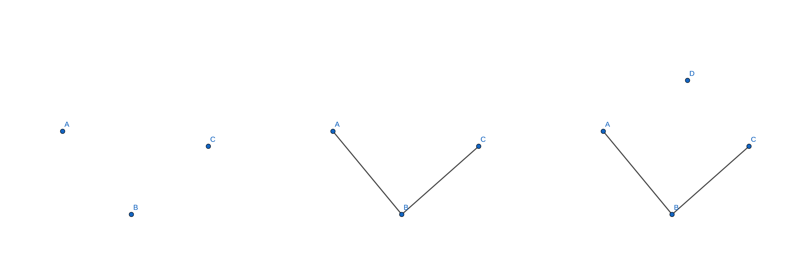
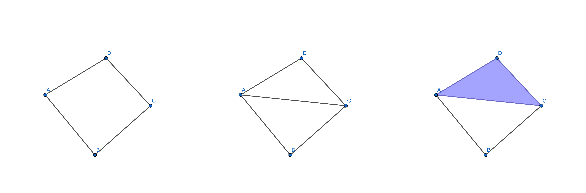
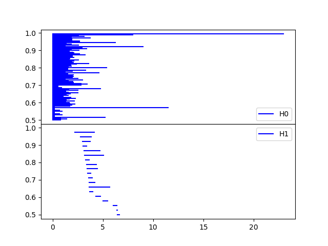
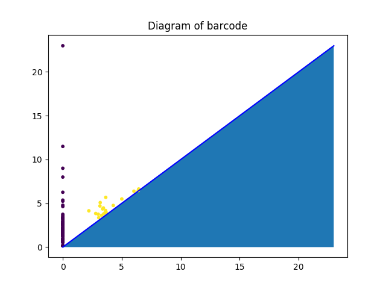

# Topological Data Analysis

### Objective
This simple project provides a pure python (optimized with numpy tensor operation as much as possible) implementation of the whole pipeline for **Persistent Homology algorithm** as described in [TDs](http://www.enseignement.polytechnique.fr/informatique/INF556/) of *Ecole polytechnique* professor M. Steve Oudot which includes 

1. Build the **Rips filtration (equivalent to Čech complex)** from a point cloud
2. Build the **Persistent module** from *Rips complex*
3. Plot the *barcode* or the *persistent diagram*.

In the step 2, I first build the sparse boundary matrix, then reduce it using Gaussian elimination algorithm under the field Z/pZ where p is a prime number (the current implementation only support p=2, but it's not complicated to adapt it to the general cases). 

*For the pratical research of development, please use the python package dionysus (2.0) or GUDHI developed by Inria (France) instead. However, this pure python implementation may offer non-C++ developer a better way to understand algorithm.*

#### Package installation

- [dionysus](http://www.mrzv.org/software/dionysus2/): pip install --verbose dionysus
- GUDHI: please follow the instruction [*here*](http://gudhi.gforge.inria.fr/doc/latest/installation.html) to compile/build the package.

### A simple example
A simple example illustrates the persistent homology algorithm.

The data *filtration* (aka complex) is described as **[Time(aka value), dim_of_homology, vertex_0, vertex_1, ..., vertex_dim]**.

- 1.0 0 A
- 1.0 0 B
- 1.0 0 C
- 2.0 1 A B
- 2.0 1 B C
- 3.0 0 D
- 4.0 1 C D
- 4.0 1 A D
- 5.0 1 A C
- 6.0 2 A D C

From left to right are respectively time 1, 2, 3

From left to right are respectively time 4, 5, 6

The barcode (aka persistent diagram) is as follows (with format **[dim_of_homology, time_start, time_end]**):

- 0 1.0 inf
- 0 1.0 2.0
- 0 1.0 2.0
- 0 3.0 4.0
- 1 4.0 inf
- 1 5.0 6.0

Therefore, we know that the Betti's number is \beta_0 = 1, \beta_1 = 1.

#### Result demonstration

The following barcode and persistent diagram come from the 2D sphere function (x,y) -> x²+y². Note that the sphere function is different from the sphere object. We have here \beta_0 = 1 and \beta_1 = 0. (For a sphere object S^n with n>0, we have \beta_0 = \beta_n= 1 and \beta_k = 0 for the other k)

